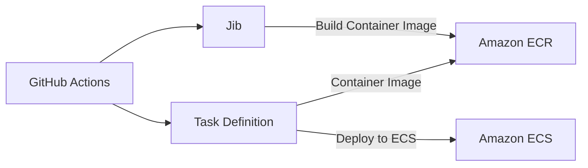

> Note: This English page scaffold was auto-generated. Full manual translation will follow.


## outline

There are two main ways to deploy a Spring Boot application:

- Build `JAR` file and deploy to `Amazon EC2`
- Build `Container Image` and deploy to `Amazon ECS`

The difference between the two approaches is in the build `format of output`, which results in a different `deployed environment`. Many references on the Internet usually show how to build `JAR` files and deploy them to `Amazon EC2`.

However, deploying to `Amazon ECS` is more effective in managing the project than this method. This is because using `Amazon ECS`, a PaaS service, manages the server itself, reducing the burden of server management.

So, I recently deployed the wedding map project from DND to `Amazon ECS` and built a deployment pipeline using `Jib` and `GitHub Actions`. In this post, I would like to introduce the `Amazon ECS` deployment automation method I built.

## Build deployment automation

### Overview

`Amazon ECS` Before we begin building deployment automation in earnest, let’s organize the deployment process step by step.



1. Build `Container Image` from `GitHub Actions` using `Jib`.
2. Push the built image to `Amazon ECR`.
3. Deploy `Container Image` defined in `Task Definition` to `Amazon ECS`.

> Don’t worry if there is something you don’t understand in the steps above. We'll go into detail about each step below.

### Amazon ECR

> If you are already using `Amazon ECR` to manage `Container Image`, you can skip to [Next Chapter](#jib).

To deploy an application to `Amazon ECS`, you must first prepare `container image`.
Container images are managed using `Container Registry` services such as `Docker Hub` or `Amazon ECR`. In this post, I will explain how to use `Amazon ECR`.

> 💡 The difference between `Docker Hub` and `Amazon ECR` is that `Docker Hub` gives `public repository` and `Amazon ECR` gives `private repository`. If you don't want your service to be public, using `Amazon ECR` is a good option.

#### Create repository

To store container images, you need to create a repository. When you access the `Amazon ECR` console and click the `Create Repository` button, the screen below appears.


Enter the repository name and click the `Create Repository` button at the bottom once more.


When you create a repository like this, a URI is created as above.
These URIs are used to build and upload `container image`.
Please copy it as it will be used in the very next chapter.

>💡 The name of the repository must be set the same as the name of `container image`. The name you specify when retrieving an image from Docker Hub has the same concept as this.

### Jib

[Jib](https://cloud.google.com/java/getting-started/jib?hl=ko) is the `Docker` image builder for `Java` provided by `Google`. `Jib` allows you to build `container image` without having to write `Dockerfile`.


If you use Docker to build a container image, you go through the same process as above. It has the disadvantage of having to write a Dockerfile and go through a multi-step build process.


On the other hand, if you use `Jib`, you can build `container image` without going through the above process and push it directly to the container registry.

#### Gradle Plugin Settings

To use `Jib`, you must add the `Gradle` or `Maven` plugin. In this post, I will explain based on using `Gradle`.

1. Add plugin

Add the `Jib` plugin to `build.gradle`.

```groovy
plugins {
 id 'com.google.cloud.tools.jib' version '3.1.4'
}
```

2. Jib settings
 
```groovy
jib {
 from {
 image = 'eclipse-temurin:17-jdk-alpine'
 }
 to {
 image = '<aws_account_id>.dkr.ecr.<region>.amazonaws.com/<repository_name>'
 tags = ['latest', "${project.version}".toString()]
 credHelper = 'ecr-login' 
 }
 container {
 creationTime = 'USE_CURRENT_TIMESTAMP'
 jvmFlags = ['-Dspring.profiles.active=prod', '-XX:+UseContainerSupport', '-Dserver.port=8080', '-Dfile.encoding=UTF-8']
 ports = ['8080']
 user = 'nobody:nogroup'
 }
}
```

The most important part of the setting is `image` in the `to` setting.
If you created a repository in `Amazon ECR` in the previous table of contents, paste the URI of the `Amazon ECR` repository in `image` into `image`.

> To push directly to the registry locally, you need to install `credHelper` settings and `credential tool`.
> For detailed settings related to this, please check with [Jib official document](https://github.com/GoogleContainerTools/jib/tree/master/jib-gradle-plugin#configuration).
> Once everything is set up, you can build the image and push it to the registry with the `./gradlew jib` command.

### Amazon ECS

> If you are already running an application based on `Amazon ECS`, you can skip to [Next Chapter](#github-actions).

In order to deploy `Amazon ECS`, it is recommended that you grasp several concepts.
In particular, it is recommended to understand `cluster`, `service`, and `task definition` even briefly.
I wasted a lot of time in the process of deploying `Amazon ECS` without understanding these concepts in the first place, but I hope those of you reading this will not do the same.

#### Cluster

`Cluster` is the unit that manages containers in `Amazon ECS`.
You can create tasks in `Amazon ECS console > Cluster tab > Create cluster`.


The most important part of the cluster creation process is `infrastructure setup`.
There are two ways to create clusters in `Amazon ECS`: `EC2` and `Fargate`.
`Fargate` is a serverless container management service that is less expensive per spec than EC2, but allows more flexibility because you pay by the hour.

You can decide depending on the situation, but I chose `EC2` to use the free tier.
`Amazone Liuux 2` was selected as the operating system and `t2.micro` was used for `instance type`.

#### Task definition

`Task Definition` is a unit that defines images or specifications required to run a container in `Amazon ECS`.
You can create tasks in `Amazon ECS console > Task Definition tab > Create a new task definition`.


At this time, you can choose between two methods: `Create a new task definition` and `Create a new task definition using JSON`. To proceed more easily, you can select `Create New Task Definition`.


In `Task Definition Family`, enter the name of the new task definition to be created and set the container items below.
An important part of the container to look at is the URI of the image. You can use the same repository URI that you used to configure `Jib`, and you can specify tags as needed.


#### service

`Service` is the unit that runs the container in `Amazon ECS` and creates it based on `Task Definition`.
You can create a service in `Amazon ECS console > Cluster tab > Select the cluster you created > Service tab > Create`.


An important part of the service creation process is setting `task definition`.
You can select the desired version of the task definition by selecting `Task Definition Family` created in the previous chapter and clicking `Revision`.

### Download task definition file

To use the task definition created in `Amazon ECS` in `Github Actions`, a configuration file in `JSON` format is required.
Using `AWS CLI`, you can easily download task definition files.

```bash
aws ecs describe-task-definition \
 --task-definition {task-definition-family} \
 --query taskDefinition > task-definition.json
```

If you run this command in the project root path, a `task-definition.json` file will be created.
Please commit the files created in this way to the `GitHub` repository so that they can be used in `Github Actions`.

### GitHub Actions

In this chapter, we will build a pipeline to push an image to `Amazon ECR` via `Github Actions` and deploy it to `Amazon ECS`.
If you have not completed all settings for `Jib`, `Amazon ECR`, and `Amazon ECS`, please refer to the previous chapter to complete them.

```yaml
name: CD
on:
 push:
 branches:
 - main
jobs:
 deploy:
 name: Deploy to AWS
 runs-on: ubuntu-latest
 steps:
 - uses: actions/checkout@v3
 - name: Configure AWS credentials
 uses: aws-actions/configure-aws-credentials@v1
 with:
 aws-access-key-id: ${{ secrets.AWS_ACCESS_KEY_ID }}
 aws-secret-access-key: ${{ secrets.AWS_SECRET_ACCESS_KEY }}
 aws-region: <AWS_REGION>
 - name: Login to Amazon ECR
 uses: aws-actions/amazon-ecr-login@v1
 - name: Set up JDK 17
 uses: actions/setup-java@v2
 with:
 java-version: 17
 distribution: 'temurin'
 cache: 'gradle'
 - name: Build and push image to Amazon ECR
 run: ./gradlew clean jib -x test
 - name: Deploy to AWS ECS
 uses: aws-actions/amazon-ecs-deploy-task-definition@v1
 with:
 task-definition: task-definition.json
 cluster: <ECS_CLUSTER_NAME>
 service: <ECS_SERVICE_NAME>
 wait-for-service-stability: true
```

The above code is a GitHub Actions pipeline that builds the application using `Jib`, pushes the image to `Amazon ECR`, and then deploys to `Amazon ECS`.
At this time, `AWS_ACCESS_KEY_ID` and `AWS_SECRET_ACCESS_KEY` must be registered in `Github Secrets`, which is the access key required to access `AWS`.

> Create a user in `AWS IAM console` granting `AmazonEC2ContainerRegistryFullAccess` and `AmazonECS_FullAccess` permissions,
> Please obtain an access key and register it in `Github Secrets`.

## Check results and resolve errors


When a commit occurs on the `main` branch, `Github Actions` builds the application and deploys the new version to `Amazon ECS`.
However, a Warning message may occur as shown in the image above, because the `task-definition.json` file contains items that do not need to be defined.
You can get rid of the Warning message by removing these entries from the `task-definition.json` file.

## Conclusion

I built the above pipeline while working on the wedding map project.
This allowed us to streamline the process of deploying new features to a production environment and reduce the burden of server management.
This is what keeps our team focused on application development.

## References

- [Building SpringBoot + Gradle jib + Github Actions + ECR + ECS pipeline](https://kevin-park.medium.com/springboot-gradle-jib-github-actions-ecr-ecs---d09dc46a6958)
