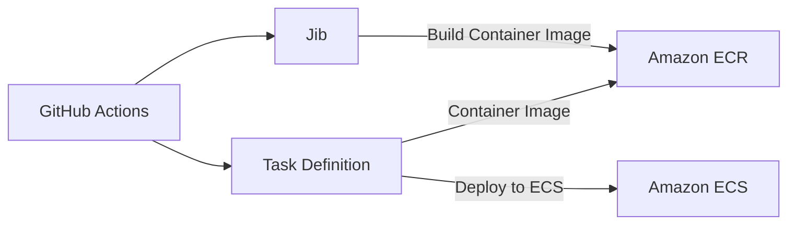

## 개요

스프링 부트 애플리케이션을 배포하는 방법에는 크게 두 가지가 있습니다.

- `JAR` 파일을 빌드하여 `Amazon EC2`에 배포
- `컨테이너 이미지`를 빌드하여 `Amazon ECS`에 배포

두 가지 방식의 차이는 빌드 `결과물의 형식`에 있으며, 이러한 결과물에 따라 `배포되는 환경`이 달라집니다. 인터넷에 나와 있는 많은 레퍼런스를 보면 대개 `JAR` 파일을 빌드하여 `Amazon EC2`에 배포하는 방법을 소개하고 있습니다. 

하지만 이러한 방법보다는 `Amazon ECS`에 배포하는 방법이 프로젝트를 관리하는 데 있어서 더욱 효과적입니다. PaaS 서비스인 `Amazon ECS`를 사용하면 자체적으로 서버를 관리해주기 때문에 서버 관리에 대한 부담이 줄어들기 때문입니다.

그래서 저는 최근에 DND에서 진행한 웨딩맵 프로젝트를 `Amazon ECS`에 배포하였고 `Jib`과 `GitHub Actions`를 사용하여 배포 파이프라인을 구축하였습니다. 이번 포스팅에서는 제가 구축한 `Amazon ECS` 배포 자동화 방식에 대해 소개해드리고자 합니다.

## 배포 자동화 구축

### Overview

`Amazon ECS` 배포 자동화 구축을 본격적으로 시작하기에 앞서, 배포 과정을 단계별로 정리해보겠습니다.



1. `GitHub Actions`에서 `Jib`을 사용하여 `컨테이너 이미지`를 빌드한다.
2. 빌드된 이미지를 `Amazon ECR`에 푸시한다.
3. `Task Definition`에 정의된 `컨테이너 이미지`를 `Amazon ECS`에 배포한다.

> 위 단계를 보고 이해가 되지 않는 부분이 있더라도 걱정하지 않으셔도 좋습니다. 아래에서 각 단계에 대해 자세히 알아볼 예정입니다.

### Amazon ECR

> 이미 `Amazon ECR`을 사용하여 `컨테이너 이미지`를 관리하고 있다면 [다음 챕터](#jib)로 넘어가셔도 좋습니다.

`Amazon ECS`에 애플리케이션을 배포하기 위해서는 우선 `컨테이너 이미지`를 준비해두어야 합니다.
컨테이너 이미지는 `Docker Hub`나 `Amazon ECR`와 같은 `컨테이너 레지스트리` 서비스를 활용하여 관리합니다. 이번 포스팅에서는 `Amazon ECR`을 사용하는 방법을 기준으로 설명하겠습니다.

> 💡 `Docker Hub`와 `Amazon ECR`의 차이는 `Docker Hub`는 `공개 레포지토리`를 제공하고 `Amazon ECR`은 `비공개 레포지토리`를 제공한다는 점입니다. 서비스의 공개를 원치 않는다면 `Amazon ECR`을 사용하는 것이 좋은 선택입니다.

#### 레포지토리 생성

컨테이너 이미지를 저장하기 위해서는 레포지토리를 생성해야 합니다. `Amazon ECR` 콘솔에 접속하여 `리포지토리 생성` 버튼을 클릭하면 아래와 같은 화면이 나타납니다.


레포지토리 이름을 입력하고 하단의 `리포지토리 생성` 버튼을 한 번 더 클릭합니다.


이렇게 리포지토리를 생성하면 위와 같이 URI가 생성됩니다.
이러한 URI는 `컨테이너 이미지`를 빌드하고 업로드하는데 사용됩니다.
바로 다음 챕터에서 사용될 것이므로 복사해두시기 바랍니다.

>💡 레포지토리의 이름은 `컨테이너 이미지`의 이름과 동일하게 설정해야 합니다. 도커 허브에서 이미지를 받아올 때 지정하는 이름이 이것과 동일한 개념입니다.

### Jib

[Jib](https://cloud.google.com/java/getting-started/jib?hl=ko)은 `Google`에서 제공하는 `Java`용 `Docker` 이미지 빌더입니다. `Jib`을 사용하면 `Dockerfile`을 작성하지 않아도 `컨테이너 이미지`를 빌드할 수 있습니다.


Docker를 사용하여 컨테이너 이미지를 빌드하는 경우 위와 같은 과정을 거칩니다. Dockerfile을 작성해야 하는 번거로움과 여러 단계의 빌드 과정을 거쳐야 한다는 단점이 있습니다.


반면 `Jib`을 사용하면 위와 같은 과정을 거치지 않고 `컨테이너 이미지`를 빌드할 수 있으며, 바로 컨테이너 레지스트리에 푸시할 수도 있습니다.

#### Gradle Plugin 설정

`Jib`을 사용하기 위해서는 `Gradle` 또는 `Maven`의 플러그인을 추가해야 합니다. 이번 포스팅에서는 `Gradle`을 사용하는 것을 기준으로 설명하겠습니다.

1. 플러그인 추가

`Jib` 플러그인을 `build.gradle`에 추가합니다.

```groovy
plugins {
  id 'com.google.cloud.tools.jib' version '3.1.4'
}
```

2. Jib 설정
   
```groovy
jib {
    from {
        image = 'eclipse-temurin:17-jdk-alpine'
    }
    to {
        image = '<aws_account_id>.dkr.ecr.<region>.amazonaws.com/<repository_name>'
        tags = ['latest', "${project.version}".toString()]
        credHelper = 'ecr-login' 
    }
    container {
        creationTime = 'USE_CURRENT_TIMESTAMP'
        jvmFlags = ['-Dspring.profiles.active=prod', '-XX:+UseContainerSupport', '-Dserver.port=8080', '-Dfile.encoding=UTF-8']
        ports = ['8080']
        user = 'nobody:nogroup'
    }
}
```

해당 설정에서 가장 중요하게 볼 부분은 `to` 설정의 `image`입니다.
이전 목차에서 `Amazon ECR`에 레포지토리를 생성했다면, `image`에 `Amazon ECR` 레포지토리의 URI를 `image`에 붙여넣어주시면 됩니다.

> 로컬에서 직접 레지스트리에 푸시하기 위해서는 `credHelper` 설정과 `인증 툴`을 설치가 필요합니다.
> 이와 관련된 자세한 설정 내용은 [Jib 공식 문서](https://github.com/GoogleContainerTools/jib/tree/master/jib-gradle-plugin#configuration)를 통해 확인해주세요.
> 모든 설정이 완료했다면 `./gradlew jib` 명령어로 이미지를 빌드하고 레지스트리에 푸시할 수 있습니다.

### Amazon ECS

> 이미 `Amazon ECS` 기반으로 애플리케이션을 운영중이라면 [다음 챕터](#github-actions)로 넘어가셔도 좋습니다.

`Amazon ECS`를 배포하기 위해서는 몇 가지 개념에 대해 잡고 가는 것을 추천드립니다.
특히 `클러스터`, `서비스`, `태스크 정의`에 대해서는 간략하게라도 이해하고 넘어가는 것이 좋습니다.
저는 처음에 이러한 개념을 이해하지 않은 채로 `Amazon ECS` 배포를 진행하는 과정에서 되려 많은 시간을 낭비했는데, 이 글을 보시는 여러분은 그러지 않기를 바랍니다.

#### 클러스터

`클러스터`는 `Amazon ECS`에서 컨테이너를 관리하는 단위입니다.
`Amazon ECS 콘솔 > 클러스터 탭 > 클러스터 생성`에서 태스크를 생성할 수 있습니다.


클러스터 생성 과정에서 가장 중요한 부분은 `인프라 설정`입니다.
`Amazon ECS`에는 `EC2`와 `Fargate` 두 가지 방식으로 클러스터를 생성할 수 있습니다.
`Fargate`는 서버리스 컨테이너 관리 서비스로, EC2보다 사양 대비 비용이 저렴하지는 않지만 시간 단위로 비용을 지불하므로 더욱 유연하게 사용할 수 있습니다.

상황에 따라 결정하시면 되지만 프리티어를 사용하기 위해 `EC2`를 선택했습니다.
운영체제로는 `Amazone Liuux 2`를 선택하고 `인스턴스 유형`은 `t2.micro`를 사용하였습니다.

#### 태스크 정의

`태스크 정의`는 `Amazon ECS`에서 컨테이너 실행에 필요한 이미지나 사양 등을 정의하는 단위입니다.
`Amazon ECS 콘솔 > 태스크 정의 탭 > 새 태스크 정의 생성`에서 태스크를 생성할 수 있습니다.


이때 `새 태스크 정의 생성`과 `JSON을 사용하여 새 태스크 정의 생성` 두 가지 방법 중 하나를 선택할 수 있는데, 간편하게 진행하기 위해서는 `새 태스크 정의 생성`을 선택하시면 됩니다.


`태스크 정의 패밀리`에는 새로 생성할 태스크 정의 이름을 입력하고, 아래 컨테이너 항목들을 설정하면 됩니다.
컨테이너에서 중요하게 볼 부분은 이미지의 URI입니다. `Jib` 설정에 사용한 레포지토리 URI를 그대로 사용하면 되며, 필요에 따라 태그를 지정할 수 있습니다.


#### 서비스

`서비스`는 `Amazon ECS`에서 컨테이너를 실행하는 단위이며 `태스크 정의`를 기반으로 생성합니다.
`Amazon ECS 콘솔 > 클러스터 탭 > 생성한 클러스터 선택 > 서비스 탭 > 생성`에서 서비스를 생성할 수 있습니다.


서비스 생성 과정에서 중요하게 볼 부분은 `태스크 정의`를 설정하는 것입니다.
이전 챕터에서 생성한 `태스트 정의 패밀리`를 선택하고 `개정`을 클릭하여 원하는 버전의 태스크 정의를 선택할 수 있습니다.

### 태스크 정의 파일 내려받기

`Amazon ECS`에서 생성한 태스크 정의를 `Github Actions`에서 사용하기 위해서는 `JSON` 형식으로 된 설정 파일이 필요합니다.
`AWS CLI`를 사용하면 쉽게 태스크 정의 파일을 내려받을 수 있습니다.

```bash
aws ecs describe-task-definition \
   --task-definition {task-definition-family} \
   --query taskDefinition > task-definition.json
```

해당 명령어를 프로젝트 루트 경로에서 실행하면 `task-definition.json` 파일이 생성됩니다.
이렇게 생성된 파일은 `Github Actions`에서 사용할 수 있도록 `GitHub` 레포지토리에 커밋해주세요.

### GitHub Actions

이 챕터에서는 `Github Actions`를 통해 `Amazon ECR`에 이미지를 푸시하고, `Amazon ECS`에 배포하는 파이프라인을 구축합니다.
`Jib`, `Amazon ECR`, `Amazon ECS`에 대한 설정을 모두 완료하지 않았다면 이전 챕터를 참고하여 완료해주세요.

```yaml
name: CD
on:
  push:
    branches:
      - main
jobs:
  deploy:
    name: Deploy to AWS
    runs-on: ubuntu-latest
    steps:
      - uses: actions/checkout@v3
      - name: Configure AWS credentials
        uses: aws-actions/configure-aws-credentials@v1
        with:
          aws-access-key-id: ${{ secrets.AWS_ACCESS_KEY_ID }}
          aws-secret-access-key: ${{ secrets.AWS_SECRET_ACCESS_KEY }}
          aws-region: <AWS_REGION>
      - name: Login to Amazon ECR
        uses: aws-actions/amazon-ecr-login@v1
      - name: Set up JDK 17
        uses: actions/setup-java@v2
        with:
          java-version: 17
          distribution: 'temurin'
          cache: 'gradle'
      - name: Build and push image to Amazon ECR
        run: ./gradlew clean jib -x test
      - name: Deploy to AWS ECS
        uses: aws-actions/amazon-ecs-deploy-task-definition@v1
        with:
          task-definition: task-definition.json
          cluster: <ECS_CLUSTER_NAME>
          service: <ECS_SERVICE_NAME>
          wait-for-service-stability: true
```

위 코드는 `Jib`을 사용하여 애플리케이션을 빌드하고 `Amazon ECR`에 이미지를 푸시한 후, `Amazon ECS`에 배포하는 GitHub Actions 파이프라인입니다.
이때 `AWS_ACCESS_KEY_ID`와 `AWS_SECRET_ACCESS_KEY`이 `Github Secrets`에 등록되어 있어야 하는데, 이는 `AWS`에 접근하기 위해 필요한 액세스 키입니다.

> `AWS IAM 콘솔`에서 `AmazonEC2ContainerRegistryFullAccess`와 `AmazonECS_FullAccess` 권한을 부여한 사용자를 생성하고,
> 액세스 키를 발급받아 `Github Secrets`에 등록해주세요.

## 결과 확인 및 에러 해결


`main` 브랜치에 커밋이 발생하면 `Github Actions`가 애플리케이션을 빌드하고 `Amazon ECS`에 새로운 버전을 배포합니다.
하지만 위 이미지와 같이 Warning 메시지가 발생할 수도 있는데 이는 `task-definition.json` 파일에 정의하지 않아도 되는 항목이 포함되어 있기 때문입니다.
`task-definition.json` 파일에서 이러한 항목들을 제거해주면 Warning 메시지를 없앨 수 있습니다.

## 마치며

저는 웨딩맵 프로젝트를 진행하는 과정에서 위와 같은 파이프라인을 구축하였습니다.
덕분에 새로운 기능을 프로덕션 환경에 배포하는 과정을 간소화할 수 있었고, 서버 관리에 대한 부담을 덜 수 있었습니다.
이것이 바로 저희 팀이 애플리케이션 개발에 몰두할 수 있었던 비결입니다.

## 참고 문헌

- [SpringBoot + Gradle jib + Github Actions + ECR + ECS 파이프라인 구축하기](https://kevin-park.medium.com/springboot-gradle-jib-github-actions-ecr-ecs-파이프라인-구축하기-d09dc46a6958)
