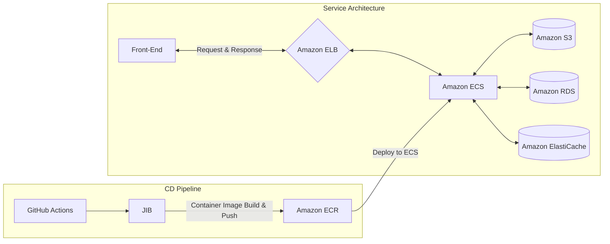

My eight-week journey at DND came to an end with the **final presentation** last Saturday (3/4). Actually, I learned a lot through this activity, but at the same time, there were some regrets. Through this article, I will try to summarize what I felt after completing the 8th DND activity.

## My own wedding planner, wedding map 💍


### Project introduction

```
Are you unsure when, where, and what to prepare for your wedding?
Hiring a planner or agency can be expensive, too. 🤔
“Could there be a service that helps engaged couples prepare their wedding schedule?”
After thinking through this problem, we created “My Wedding Planner, WeddingMap.”
```

### Project duration

- 2022.01.08 ~ In progress

### Related Links

- [Figma](https://www.figma.com/file/L9GlKlkD8HbxkUClnJs3YQ/DND-8%EA%B8%B0-%EA%B2%B0%ED%98%BC-%EC%A4%80%EB%B9%84-%EC%84%9C%EB%B9%84%EC%8A%A4_%EC%9B%A8%EB%94%A9%EB%A7%B5?node-id=112%3A2)
- [Frontend Repository](https://github.com/dnd-side-project/dnd-8th-8-frontend)
- [Backend repository](https://github.com/dnd-side-project/dnd-8th-8-backend)
- [Backend API document](https://dnd-side-project.github.io/dnd-8th-8-backend/)

## Collaboration method 🤝

### Communication

- Communication through `Slack`, `Discord`
- Sharing design work through `Figma`
- Issue management through `GitHub Projects`
- Preparation of meeting minutes through `Notion`

### Team Culture

Personally, one of the things I was satisfied with while working on this project was **team culture**. We held a daily scrum every morning with our team members, and a KPT retrospective every Saturday.

#### Daily Scrum

At `Daily Scrum`, we briefly shared each other's work progress and what we were going to do today.
If any problems arose during the work process, they were briefly shared and additional meetings were held as needed.
The progress time was short, only 15 minutes, but it allowed us to quickly understand each other's work.

#### KPT Retrospective

One of the retrospective methods, `KPT(Keep/Problem/Try)`, was used.
We looked back on the team's activities over the past week, shared what we found satisfactory or disappointing, and discussed ways to improve.
Thanks to this, we were able to quickly identify and solve problems that occurred within the team and increased trust among team members.

### Convention

Our team manages the project efficiently by defining several conventions.
Commit messages and branch naming conventions are defined equally for both the front and back ends as follows.

- Commit message: [Conventional Commits](https://www.conventionalcommits.org/ko/v1.0.0/)
- Branch naming: [Git Flow](https://danielkummer.github.io/git-flow-cheatsheet/index.ko_KR.html)

In the case of coding conventions, the frontend uses `EsLint` and `Prettier` for checking and formatting.
The backend is being checked using `Checkstyle`.

> Checkstyle is set to follow [Google Java Style Guide](https://google.github.io/styleguide/javaguide.html).

## Individual growth is the growth of the team 📈

I think one of the advantages of side projects is that they are `Challenge something you have never experienced before`.
In this project, I gained experience building various `CI/CD pipeline`.
However, this was a great help not only in my personal growth but also in improving the quality of the project itself.

### Achieved 70% test coverage

The source code of the wedding map backend maintains a test coverage of over 70%.
This was possible because the quality of the source code was continuously managed in conjunction with `SonarCloud`.
Before new features were merged, code below a certain coverage level was set to not be merged, and through this, we were able to continuously maintain coverage above a certain level.

> You can check the actual test coverage in detail at [Wedding Map SonarCloud Dashboard](https://sonarcloud.io/summary/new_code?id=dnd-side-project_dnd-8th-8-backend).

> The wedding map backend uses `SonarCloud` and `Checkstyle` together.
> If you are curious about this method, please refer to the [Integrating SonarCloud and Checkstyle](/posts/devops/interate-sonarcloud-with-checkstyle) article.

### API documentation

Wedding Map's backend API document is provided using `Spring Rest Docs`.
Since documentation is done at the same time as test code is written, only the functions currently provided are documented.
Always providing up-to-date API documentation has been a great help in communicating with the front-end team.

Documentation pages are currently being distributed as [corresponding address](https://dnd-side-project.github.io/dnd-8th-8-backend/) using `GitHub Pages`.
All deployment processes are automated using `GitHub Actions`.

> For more details, please refer to the [Deploy GitHub Pages with official Actions](/posts/devops/deploy-github-pages-with-actions/) article.

### Automated server deployment based on Amazon ECS



**Wedding Map** is operated based on a Spring application deployed on `Amazon ECS`.
We built `CD Pipeline`, which builds and deploys a new version of the container as soon as changes are merged into the main branch.

> We will write more details about Amazon ECS deployment automation in a future post.

By building a deployment pipeline, our server deployment cycle has become very fast, allowing us to deliver new features quickly.
Additionally, while providing services through `Amazon ECS`, `Providing stable services` was possible rather than managing EC2 servers directly.

> In the case of `Amazon ECS`, it provides a function to monitor the status of deployed containers and alert `automatic restart` if an error occurs.
Additionally, native support for `Blue/Green deployment` improves service availability.

## What’s disappointing 📝

### Service official deployment

Our service finished the 8th DND without being able to officially distribute it.
It was a very disappointing result for me, who wanted to build `service operation experience`.
However, our team is still focused on perfecting the service.
Although DND activities are officially over, we plan to complete and deploy the service by April.

### Missing exception handling

As the service was developed within a short period of time, there were many exception handling logics that were missing.
Even if there was exception logic, there were cases where only an error was output on the server and `frontend not responding`.
As feature development progresses, we plan to modify it to add missing exception handling.

### Test code is also code

Test code is also `maintenance management target` and you should care about its quality.
However, with so much focus on improving test coverage, quality was somewhat neglected.
In the future, I thought that we should also pay attention to the quality of test code during the process of developing features.

## Conclusion

It was my first time participating in a project from planning to development, so I was a bit clumsy, but it was a time where I learned a lot.
In particular, I was most satisfied with being able to properly use `Scrum` or `retrospective` of `agile methodology`.
This felt even more meaningful because this process had not been properly carried out in school team projects before.

After completing DND activities, I reflected on the differences between the wedding map and previous projects.
I think the final conclusion was in `transparency in communication`.
In the project conducted at school, the process of presenting one's opinion and listening to the opinions of team members was not properly implemented.
So there was frequent `conflict of opinions` between team members, and each person’s `direction of the project` thoughts were different.
As a result, the project failed miserably.

For me, the experience of this project was also an opportunity to do my previous work.
I think it was an experience I was able to gain thanks to the good team members and management.
We will conclude our DND activities with a very grateful heart and will work hard until the final completion of the wedding map project. 🚀
