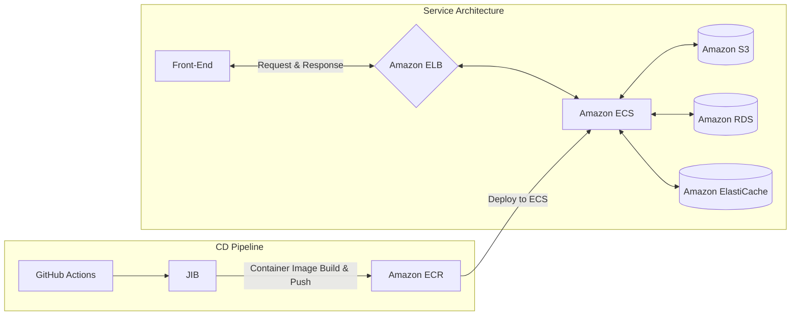

지난 토요일(3/4)에 **최종 발표**를 마치는 것으로 DND에서 보낸 8주간의 여정이 끝났습니다. 사실 이번 활동을 통해 많은 것을 배웠지만, 한편으로는 아쉬운 점도 남았습니다. 이번 글을 통해 DND 8기 활동을 마치며 느낀 점을 정리해보려고 합니다.

# 나만의 웨딩플래너, 웨딩맵 💍


## 프로젝트 소개

```
결혼을 준비할 때 언제, 어디서, 무엇을 준비할지 막막하지 않으신가요?
그렇다고 플래너나 업체를 동반 하자니 가격이 만만치 않죠 🤔
“예비부부들의 결혼 일정 준비를 도와주는 서비스가 없을까?”
이러한 고민 끝에 저희는 ‘나만의 웨딩플래너, 웨딩맵’을 만들게 되었어요.
```

## 프로젝트 기간

- 2022.01.08 ~ 진행중

## 관련 링크

- [피그마](https://www.figma.com/file/L9GlKlkD8HbxkUClnJs3YQ/DND-8기-결혼-준비-서비스_웨딩맵?node-id=112%3A2)
- [프론트엔드 레포지토리](https://github.com/dnd-side-project/dnd-8th-8-frontend)
- [백엔드 레포지토리](https://github.com/dnd-side-project/dnd-8th-8-backend)
- [백엔드 API 문서](https://dnd-side-project.github.io/dnd-8th-8-backend/)

# 협업 방식 🤝

## 커뮤니케이션

- `Slack`, `Discord` 통한 소통
- `Figma`를 통한 디자인 작업물 공유
- `GitHub Projects`를 통한 이슈 관리
- `Notion`을 통한 회의록 작성

## 팀 문화

개인적으로 이번 프로젝트를 진행하면서 만족스러웠던 중 하나는 **팀 문화**였습니다. 팀원들과 함께 매일 아침에 데일리 스크럼을 진행하였고, 매주 토요일에 KPT 회고를 진행했습니다.

### 데일리 스크럼

`데일리 스크럼`에서는 서로의 업무 진행 상황과 오늘 할 일에 대해 간략히 공유하는 시간을 가졌습니다.
만약 업무 진행중 발생한 문제가 있다면 간략히 공유만 하였고, 필요에 따라 추가 회의를 진행하였습니다.
진행 시간은 15분으로 짧았지만 그 덕에 빠르게 서로의 업무를 이해할 수 있었습니다.

### KPT 회고

회고 방식 중 하나인 `KPT(Keep/Problem/Try)`를 사용하였습니다.
지난 한 주간의 팀 활동을 돌아보며 만족스러운 점 또는 아쉬운 점을 공유하였고 개선방안에 대해서 논의하였습니다.
덕분에 팀 내에서 발생한 문제를 빠르게 파악하고 해결할 수 있었고 팀원들 간의 신뢰도가 높아졌습니다.

## 컨벤션

저희 팀은 여러 컨벤션을 정의하여 효율적으로 프로젝트를 관리하고 있습니다.
커밋 메시지와 브랜치 네이밍 컨벤션에 대해서는 프론트, 백엔드 모두 동일하게 아래와 같이 정의하였습니다.

- 커밋 메시지: [Conventional Commits](https://www.conventionalcommits.org/ko/v1.0.0/)
- 브랜치 네이밍: [Git Flow](https://danielkummer.github.io/git-flow-cheatsheet/index.ko_KR.html)

코딩 컨벤션의 경우 프론트엔드는 `EsLint`와 `Prettier`를 사용하여 검사 및 포매팅을 하고 있으며,
백엔드는 `Checkstyle`을 사용하여 검사하고 있습니다.

> Checkstyle의 경우 [Google Java Style Guide](https://google.github.io/styleguide/javaguide.html)를 따르도록 설정하였습니다.

# 개인의 성장은 팀의 성장으로 📈

사이드 프로젝트의 장점 중 하나는 `이전에 경험해보지 못한 것에 도전`하는 것이라 생각합니다.
저는 이번 프로젝트에서 다양한 `CI/CD 파이프라인`을 구축하는 경험을 쌓았습니다.
하지만 이는 제 개인적인 성장뿐 아니라 프로젝트 자체의 퀄리티를 높이는데도 큰 도움이 되었습니다.

## 테스트 커버리지 70% 달성

웨딩맵 백엔드의 소스코드는 테스트 커버리지 70% 이상을 유지하고 있습니다.
이러한 것이 가능했던 것은 `SonarCloud`와 연동하여 지속적으로 소스코드의 품질을 관리하였기 때문입니다.
새로운 기능이 머지되기 이전에 일정 커버리지 이하의 코드는 머지되지 않도록 설정하였고, 이를 통해 지속적으로 커버리지를 일정 수준 이상 유지할 수 있었습니다.

> 실제 테스트 커버리지는 [웨딩맵 SonarCloud 대시보드](https://sonarcloud.io/summary/new_code?id=dnd-side-project_dnd-8th-8-backend)에서 자세히 확인하실 수 있습니다.

> 웨딩맵 백엔드는 `SonarCloud`와 `Checkstyle`을 함께 연동하여 사용하고 있습니다.
> 해당 방법이 궁금하신 분은 [SonarCloud와 Checkstyle을 통합하여 사용하기](/posts/devops/interate-sonarcloud-with-checkstyle) 글을 참고해주세요.

## API 문서화

웨딩맵의 백엔드 API 문서는 `Spring Rest Docs`를 사용하여 제공하고 있습니다.
테스트 코드를 작성함과 동시에 문서화를 진행하는 방식이므로 현재 제공하는 기능에 대해서만 문서화가 이루어집니다.
항상 최신화된 API 문서를 제공하는 덕분에 프론트엔드 팀과의 소통에도 큰 도움이 되었습니다.

문서화 페이지는 현재 `GitHub Pages`를 사용하여 [해당 주소](https://dnd-side-project.github.io/dnd-8th-8-backend/)로 배포하고 있습니다.
모든 배포 과정은 `GitHub Actions`를 사용하여 자동화되어 있습니다.

> 더 자세한 내용은 [공식 Actions를 활용한 GitHub Pages 배포](/posts/devops/deploy-github-pages-with-actions/) 글을 참고해주세요.

## Amazon ECS 기반의 서버 배포 자동화



**웨딩맵**은 `Amazon ECS`에 배포된 스프링 애플리케이션을 중심으로 운영되고 있습니다.
main 브랜치에 변경사항을 머지하는 즉시 새로운 버전의 컨테이너가 빌드되고 배포되는 `CD 파이프라인`을 구축하였습니다.

> Amazon ECS 배포 자동화에 대한 자세한 내용은 추후 포스팅에 작성할 예정입니다.

배포 파이프라인을 구축한 덕분에 서버 배포 주기가 매우 빨라졌고, 새로운 기능을 빠르게 제공할 수 있게 되었습니다.
또한 `Amazon ECS`를 통해 서비스를 제공하면서 직접 EC2의 서버를 관리하는 것보다 `안정적인 서비스 제공`이 가능하였습니다.

> `Amazon ECS`의 경우 배포된 컨테이너의 상태를 모니터링하고, 이상이 발생할 경우 `자동 재시작`해주는 기능을 제공합니다.
또한 `Blue/Green 배포`를 기본적으로 지원하므로 서비스의 가용성을 높일 수 있습니다.

# 아쉬운 점 📝

## 서비스 정식 배포

저희 서비스는 정식 배포를 못한 상태로 DND 8기를 마무리하였습니다.
`서비스 운영 경험`을 쌓고 싶었던 저에게는 많이 아쉬운 결과였습니다.
하지만 저희 팀은 모두 여전히 서비스를 완성시키는 것에 목표를 두고 있습니다.
비록 DND 활동은 공식적으로 끝났지만 4월까지 서비스를 완성하고 배포할 계획입니다.

## 누락된 예외처리

짧은 기간 내 서비스를 개발하다 보니 누락된 예외처리 로직이 많았습니다.
예외로직이 있더라도 서버 상에서 에러만 출력하고 `프론트엔드에 응답하지 않는` 경우도 있었습니다.
기능 개발을 진행하면서 누락된 예외처리를 추가할 수 있도록 수정할 예정입니다.

## 테스트 코드도 코드다

테스트 코드 또한 `유지보수 관리 대상`이며 퀄리티를 신경써야 합니다.
하지만 테스트 커버리지를 높이기 위한 노력에 치중한 나머지 퀄리티에는 다소 소홀했습니다.
앞으로는 기능을 개발하는 과정에서 테스트 코드의 퀄리티도 신경쓸 수 있도록 해야겠다는 생각이 들었습니다.

# 마치며

기획부터 개발까지 모든 과정에 참여한 프로젝트가 처음이라 서툴렀지만 많은 것을 배울 수 있는 시간이었습니다.
특히 `애자일 방법론`의 `스크럼`이나 `회고`를 제대로 사용해볼 수 있었다는 점이 가장 만족스러웠습니다.
이전에 학교 팀프로젝트에서는 이러한 과정이 제대로 이루어지지 않았기 때문에 더욱 그 의미가 크게 느껴졌습니다.

DND 활동을 마친 후 웨딩맵과 이전 프로젝트 사이에 어떤 차이가 있었는지 되새겨봤습니다.
마침내 내린 결론은 `의사소통의 투명성`에 있었다고 생각합니다.
학교에서 진행한 프로젝트에서는 자신의 의견을 제시하고 팀원들의 의견을 듣는 과정이 제대로 이루어지지 않았습니다.
그래서 팀원들 간의 `의견 충돌`이 잦았고 서로가 생각하는 `프로젝트의 방향성`이 달랐습니다.
그 결과 프로젝트는 처참하게 실패했습니다.

저에게 있어서 이번 프로젝트의 경험은 이전의 `실패를 극복`하기 위한 기회이기도 하였습니다.
좋은 팀원들과 운영진분들이 함께한 덕분에 얻을 수 있는 경험이었다고 생각합니다.
너무나 감사한 마음으로 DND 활동을 마무리하고, 웨딩맵 프로젝트 최종 완성까지 끝까지 노력해보겠습니다. 🚀
